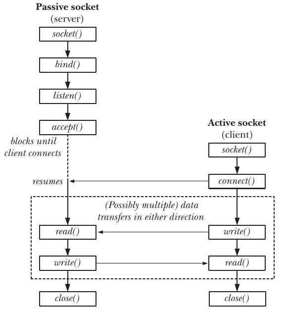
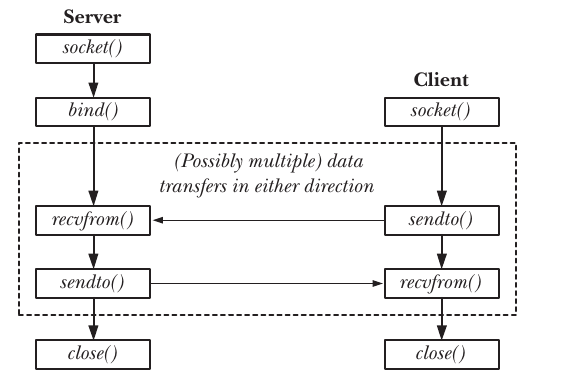

# IF019 - TP4

Trabajo Práctico 4 de Redes y Transmisión de Datos

## Compilar

Para facilitar el inicio del TP, van a encontrar dos archivos `.c`, uno para cada servidor, en donde deberían empezar a implementarlos.

Para compilarlos, utilizar el comando `make`. Por ejemplo, para compilar `server-tftp.c` debe ejecutar el comando `make server-tftp` (sin la extensión `.c`). De manera similar, pueden compilar `server-chat.c`. Si no indican un parámetro a `make`, se compilan ambos programas.

## Entrega

Para la entrega final, generar un archivo zip mediante `make zip` y enviarlo por email.

## Sockets

Llamadas al sistema necesarias:

- [socket()](https://www.man7.org/linux/man-pages/man2/socket.2.html): crea un *socket*.
- [bind()](https://man7.org/linux/man-pages/man2/bind.2.html): asocia un *socket* a una dirección.
- [listen()](https://man7.org/linux/man-pages/man2/listen.2.html): espera por conexiones entrantes.
- [accept()](https://man7.org/linux/man-pages/man2/accept.2.html): acepta una conexión entrante.
- [connect()](https://man7.org/linux/man-pages/man2/connect.2.html): conecta con otro *socket*.
- [close()](https://man7.org/linux/man-pages/man2/close.2.html): cierra la conexión (descriptor).
- [recvfrom()](https://man7.org/linux/man-pages/man2/recvmsg.2.html): recibe un datagrama.
- [sendto()](https://man7.org/linux/man-pages/man2/send.2.html): envía un datagrama.

Estructuras de datos:

- [struct sockaddr](https://man7.org/linux/man-pages/man3/sockaddr.3type.html): estructura genérica utilizada para castear al invocar ciertas llamadas al sistema.
- [struct sockaddr_in](https://man7.org/linux/man-pages/man3/sockaddr.3type.html): estructura que representa una dirección IPv4.

Otras funciones de biblioteca útiles:

- [inet_aton, inet_addr, inet_ntoa](https://man7.org/linux/man-pages/man3/inet_addr.3.html): rutinas de manipulación de direcciones IP.
- [htonl, htons, ntohl, ntohs](https://man7.org/linux/man-pages/man3/htons.3.html): cambia el orden de bytes (host a red o viceversa).

### Orden de invocación (orientado a la conexión)

### Orden de invocación (Datagramas)

